# Getting started with **stsimcbmcfs3**

## Quickstart Tutorial

This quickstart tutorial will introduce you to the basics of working with stsimcbmcfs3. The steps include:
 
* Installing stsimcbmcfs3
* Creating a new stsimcbmcfs3 Library
* Configuring the stsimcbmcfs3 Library
* Viewing model inputs
* Running the model
* Analyzing the results

## **Step 1: Install stsimcbmcfs3**
**stsimcbmcfs3** is a Package within the <a href="https://syncrosim.com/download/" target="_blank">Syncrosim</a> simulation modeling framework; as such, running **stsimcbmcfs3** requires that the **SyncroSim** software be installed on your computer. Download and install **SyncroSim 2.3.9 or later** <a href="https://syncrosim.com/download/" target="_blank">here</a>. **stsimcbmcfs3** also requires installation of the CBM-CFS3 <a href="https://www.nrcan.gc.ca/climate-change/impacts-adaptations/impacts-forests/carbon-accounting/carbon-budget-model/13107?utm_campaign=DFATD&utm_medium=twitter&utm_source=tweet44" target="_blank">Database</a> and R version <a href="https://www.r-project.org/" target="_blank">4.0.2</a> or later.
> **Note:** stsimcbmcfs3 also requires the following R packages:  rsyncrosim, tidyverse, and RODBC. 

Once all required programs are installed, open **SyncroSim** and select **File -> Packages... -> Install...**, and select the **stsim**, **stsimsf**, and **stsimcbmcfs3** packages and click OK. Alternatively, download the <a href="https://github.com/ApexRMS/stsimcbmcfs3/releases" target="_blank">latest release</a> from GitHub. Open **SyncroSim** and select **File -> Packages... -> Install From File...**, then navigate to the downloaded package file with the extension *.ssimpkg*.
* **ST-Sim:** package for creating and running state-and-transition simulation models. See <a href="https://docs.stsim.net/" target="_blank">documentation</a>.
* **Stock-Flow Add-On for ST-Sim:** package for modelling stocks and flows within state-and-transition simulation models. See <a href="https://docs.stsim.net/" target="_blank">documentation</a>.

## **Step 2: Create a new stsimcbmcfs3 Library**
Having installed the **stsimcbmcfs3** Package, you are now ready to create your first SyncroSim Library. A Library is a file (with extension *.ssim*) that contains all of your model inputs and outputs. Note that the format of each Library is specific to the Package for which it was initially created. To create a new Library, choose **New Library...** from the **File** menu.
 
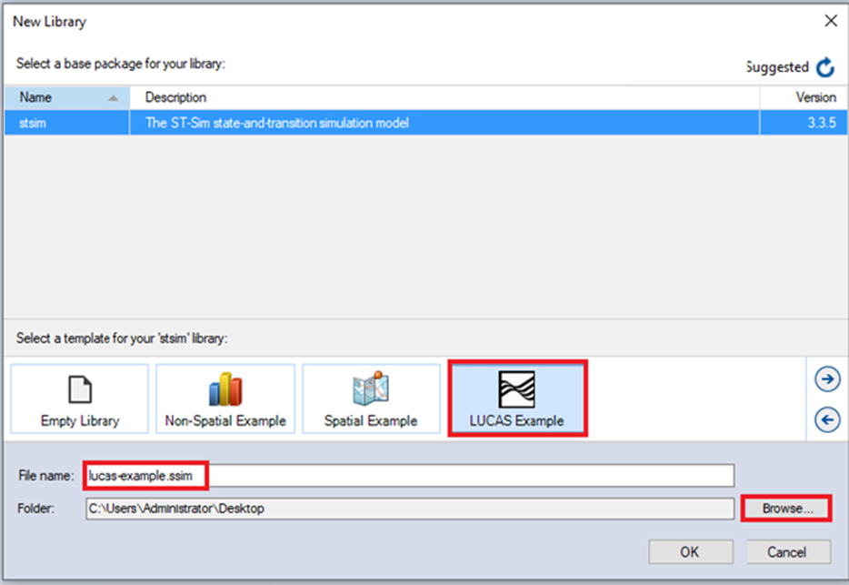
 
In this window:
 
* Select the row for **stsim**. Note that as you select a row, the list of **Templates** available and suggested **File name** for that base package are updated.
* Select the **LUCAS Example Template** as shown above.
* Optionally type in a new **File name** for the Library (or accept the default); you can also change the target **Folder** using the **Browse...** button.
> **Note:** If you intend on using Multiprocessing (recommended), ensure your SyncroSim Library is saved to the C: Drive. Saving your library to OneDrive will result in an error when completing a model run.

When you are ready to create the Library file, click **OK**. A new Library will be created and loaded into the Library Explorer.

## **Step 3: Configure library settings**
For the model to run, SyncroSim needs the locations of your R and the CBC-CFS3 Database. The R executable will be found automatically. To check, double-click on **LUCAS Example** and navigate to the **Options** tab. In the **R Configuration** datasheet, you should see the file path to your R executable. If not, click **Browse...** and navigate to the correct file location. The CBM-CFS3 file path is set to the default location that was recommended during the installation of the database. If the CBM-CFS3 Database was not installed to the default location, select the Folder icon, and navigate to the proper location on your local computer, then click **Open**.
 
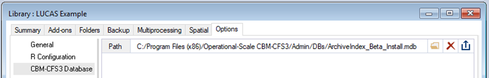

## **Step 4: Review the model inputs**
The contents of your newly created Library are now displayed in the Library Explorer. Model inputs in SyncroSim are organized into Scenarios, where each Scenario consists of a suite of values, one for each of the Model's required inputs.

Because you chose the **LUCAS Example** template when you created your Library, your Library already contains four folders:
* Predefined Inputs
* User Defined Inputs
* Run Setup
* Run Forecast

The **Predefined Inputs** folder contains pre-configured Scenarios that act as inputs for the **Run Setup** and **Run Forecast** Scenarios. The **User Defined Inputs** folder contains two sub-folders (**Run Setup Inputs** and **Run Forecast Inputs**) that house user input Scenarios that need to be populated before running the **Run Setup** and **Run Forecast** Scenarios.
>**Note:** The **User Defined Inputs** have been populated to provide an executable example to help you get started quickly.

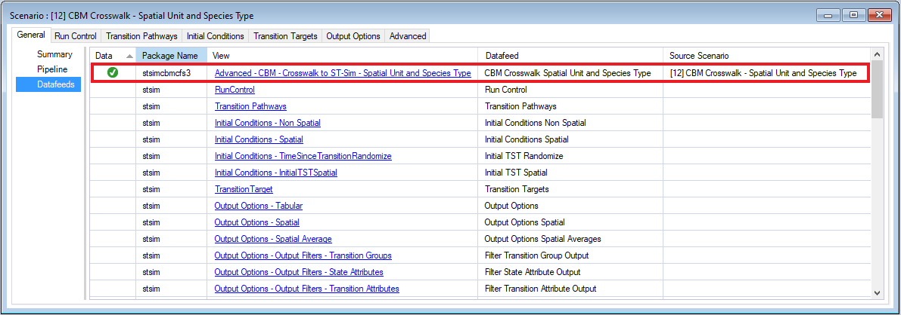
 
In the **User Defined Inputs** folder, select and review the inputs for the Scenarios in the **Run Setup Inputs** sub-folder.
* Select the Scenario named **CBM-CFS3 Crosswalk – Spatial Unit and Species Type** in the Library Explorer.
* Right-click and choose **Properties** from the context menu to view the details of the Scenario.

This opens the Scenario Properties window. The first tab in this window, called **General**, contains three datasheets. The first, **Summary**, displays some general information for the Scenario. The second, **Pipeline**, allows the user to select the run order of the inputs in the model. Finally, the **Datafeeds** datasheet (shown below) displays a list of all data sources.

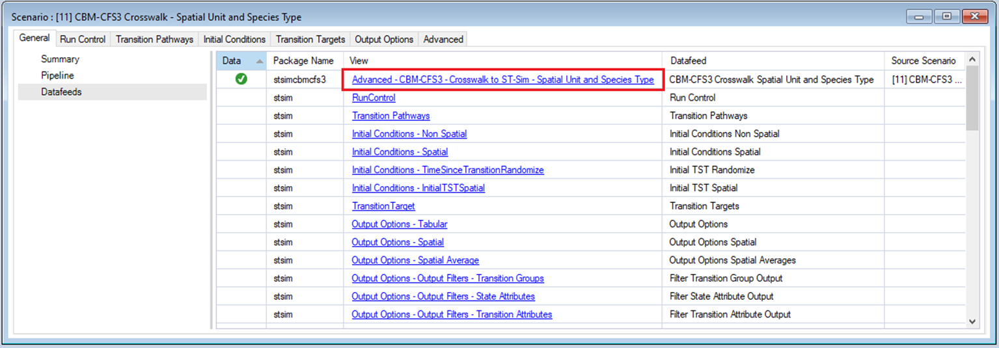
 
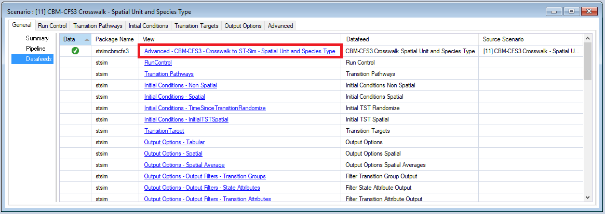
 
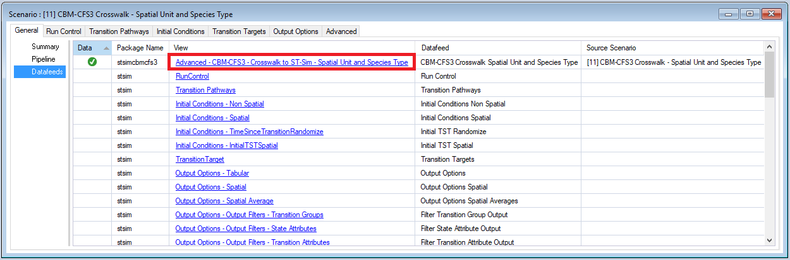
 

Select the **CBM-CFS3 Crosswalk – Spatial Unit and Species Type** datafeed to view the example inputs.

This example is setup to simulate four different forest types in the Sierra Nevada Ecoregion of California:

* Western Oak,
* California Mixed Conifer,
* Ponderosa Pine, and  
* Alder/Maple

The crosswalk datasheet allows a user to associate each forest type to a CBM-CFS3 equivalent combination of Ecological Boundary, Admin Boundary and Species Type.  Here a user can specify temperature values that should be used when modeling dead organic matter transfer and decay rates.  Note that if temperature values are not specified, the default values for the selected Ecological Boundary will be used. Here a user must also load CBM-CFS3 output files that are used to calculate growth rates by biomass pool.  Outputs loaded from the CBM-CFS3 can eventually be compared against simulations run in ST-Sim for validation purposes (see **Step 6**).
 
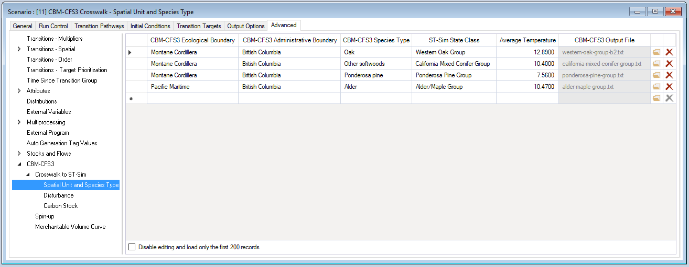
 
>**Note:** In the example, the "ST-Sim Stratum and ST-Sim Secondary Stratum" columns have been populated and hidden for image clarity. In a custom Library, users will need to manually set values for these columns.

Looking at the **Spin-up** Scenario, we see that each ST-Sim State Class defined in the species crosswalk has been linked with each transition (disturbance) type.   
 
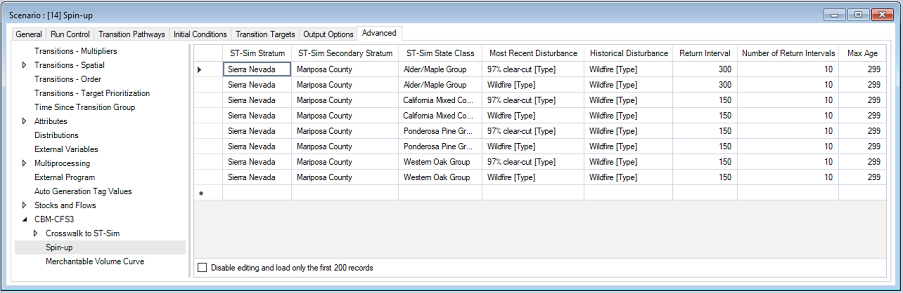
 
With all Scenarios in the **User Defined Inputs** folder populated, the **Run Setup** Scenarios can now be run.
 
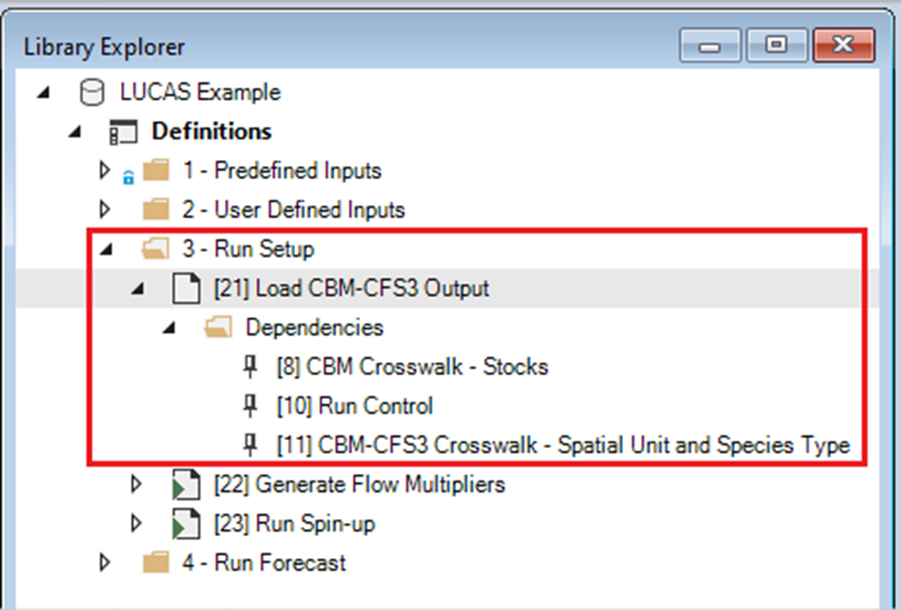
 
Click on the Scenarios in **Run Setup** to view dependencies and familiarize yourself with each Scenario's inputs.  

## **Step 5: Run the model**
Right-click on the **Load CBM-CFS3 Output** Scenario in the **Scenario Manager** window and select **Run** from the context menu. If prompted to save your project, click **Yes**. If the run is successful, you will see a Status of **Done** in the **Run Monitor** window, at which point you can close the **Run Monitor** window; otherwise, click on the **Run Log** link to see a report of any problems. Make any necessary changes to your Scenario, then re-run the Scenario.
 
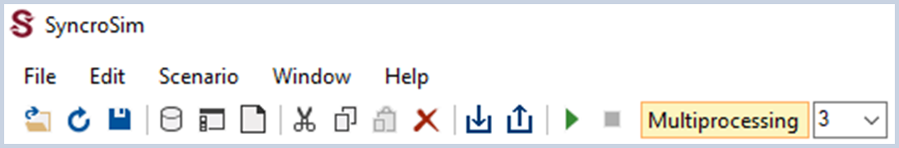
 
>**Note:** If you encounter an error in your model run, you may need to install Microsoft Access Database Engine <a href="https://www.microsoft.com/en-us/download/details.aspx?id=54920" target="_blank">2016 Redistributable</a>.

Next, repeat the steps above to run the **Generate Flow Multiplier** and **Run Spin-up** Scenarios.  
>**Note:** The **Run Setup** and **Run Forecast** Scenarios rely on dependencies that are defined in **Predefined Inputs** and **User Defined Inputs**, as well as results from previous **Run Setup** Scenarios. For this reason, it is important the Scenarios are run in sequence.  

Once the **Run Setup** Scenarios have completed successfully, the **Run Forecast** Scenarios can be run. At this point, **Multiprocessing** should be enabled with 3 jobs.
 
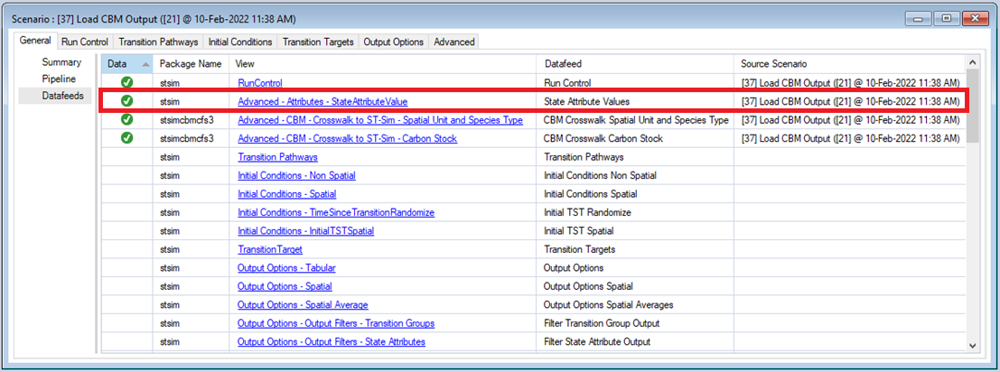
 
Click on the **Single Cell – No Disturbance** and **Landscape** Scenarios to familiarize yourself with the Scenario inputs. Repeat the steps above to run the two Scenarios.

## **Step 6: Analyze the results**
You can now view the results of your **Single Cell – No Disturbance** run and compare the results with validation outputs generated by the **Load CBM-CFS3 Output** Scenario.
 
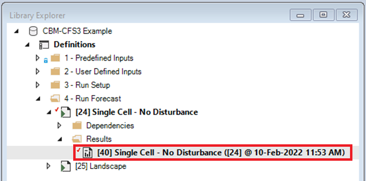
 
> **Note:** You can add and remove Results Scenarios from the list of Scenarios being analyzed by selecting a Scenario in the Library Explorer and then choosing either **Add to Results** or **Remove from Results** from the Scenario menu. **Scenarios** currently selected for analysis are highlighted in **bold** in the Library explorer.

To view results from your **Single Cell – No Disturbance** run, move to the **Charts** tab at the bottom left of the **Scenario Manager** screen and double-click on the **Single Cell – Biomass** chart to open it.
 
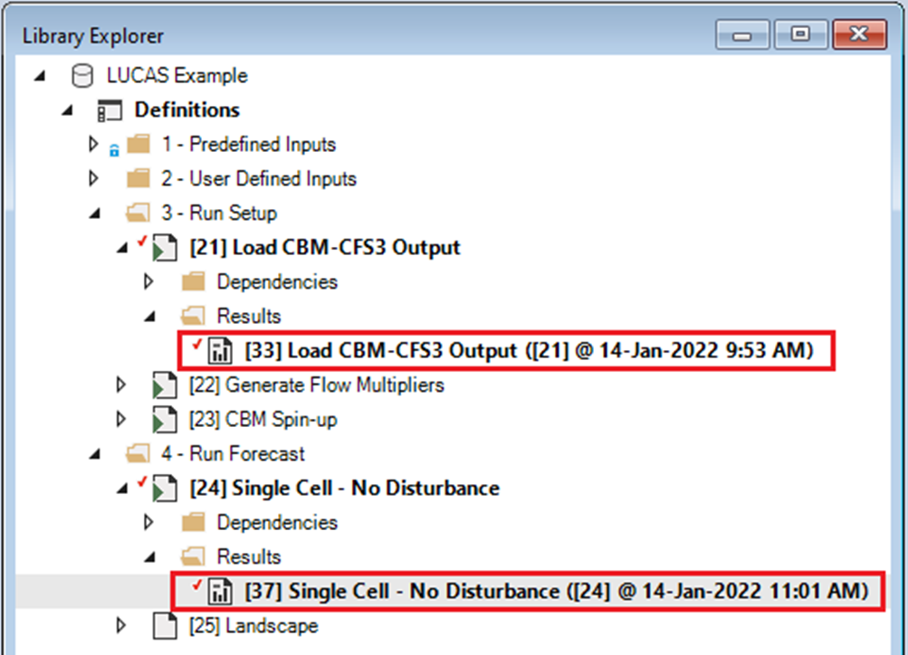
 
The following window should open.
 
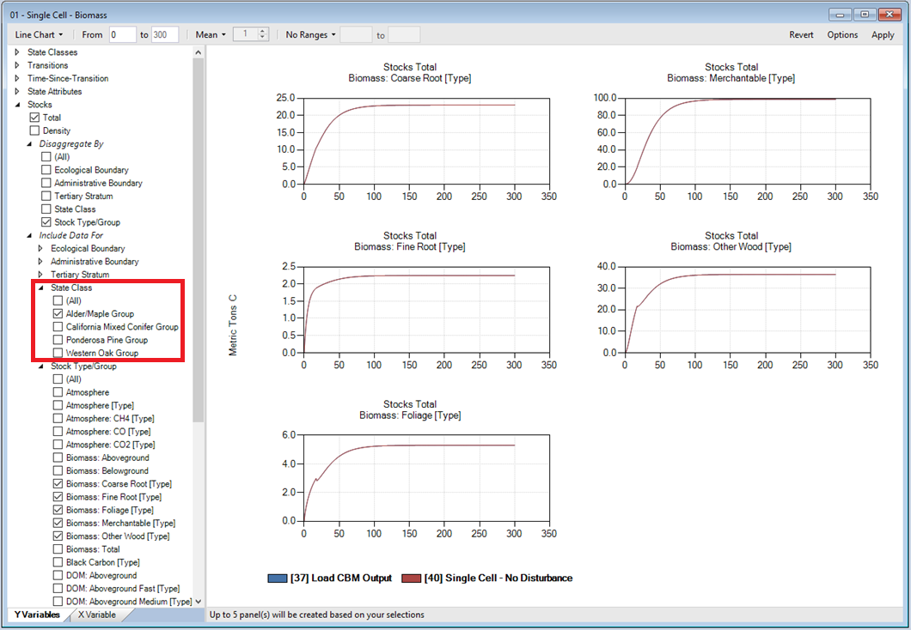
 
Double-click on the **Single Cell – Aboveground DOM** and **Single Cell – Belowground DOM** charts to view the results. You can view results for the different forest types by changing the **State Class** selection and then clicking **Apply**.  When done viewing the **Single Cell** Results, remove the **Load CBM-CFS3 Output** and **Single Cell – No Disturbance Scenarios** from the Results Viewer.

To view spatial results, add the **Landscape** Scenario to the Results and then select the Maps tab from the bottom of the **Scenario Manager** window (i.e. beside the **Charts** tab). Double click on the **Biomass** Map. By default, the mapping window should display Wildfire events and changes in Total Biomass over time.
 
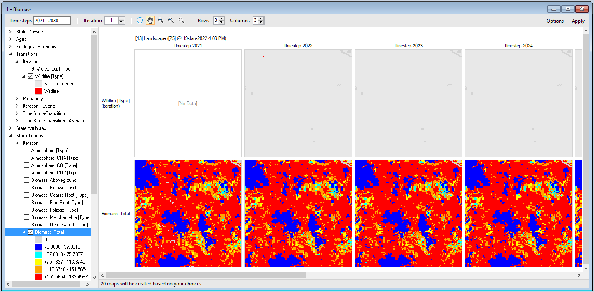
 
Double click on **Flows** and **Age** Maps to view changes in carbon flows and forest age for the **Landscape** Scenario.
