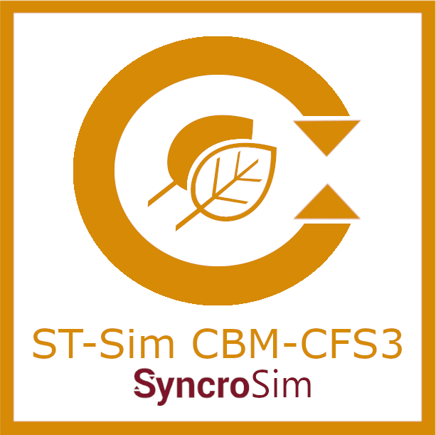

# **stsimcbmcfs3** SyncroSim Package

    <a href="https://github.com/ApexRMS/stsimcbmcfs3">
 
## Landscape scale forest carbon simulations
### *stsimcbmcfs3* is an open-source <a href="https://syncrosim.com/download/" target="_blank">Syncrosim</a> add-on package to <a href="http://docs.stsim.net" target="_blank">ST-Sim</a> for integrating dynamics from the Carbon Budget Model for the Canadian Forest Sector (CBM-CFS3) into the ST-Sim landscape simulation model.

**stsimcbmcfs3** integrates inputs and outputs from the <a href="https://www.nrcan.gc.ca/climate-change/impacts-adaptations/climate-change-impacts-forests/carbon-accounting/carbon-budget-model/13107" target="_blank">Carbon Budget Model</a> for the Canadian Forest Sector (CBM-CFS3) into landscape scale simulations using the <a href="http://docs.stsim.net" target="_blank">ST-Sim</a> and <a href="https://apexrms.github.io/stsimsf/" target="_blank">stsimsf</a> <a href="https://syncrosim.com/" target="_blank">Syncrosim</a> packages. The package allows users to load outputs from the CBM-CFS3, calculate flow rates by carbon pool based on CBM-CFS3 parameters and user defined temperatures, run spin up simulations to create initial carbon maps based on forest type and recent disturbance, and generate spatially explicit forecasts of forest carbon under alternative scenarios.

**stsimcbmcfs3** is a package that plugs into the <a href="https://syncrosim.com/" target="_blank">Syncrosim</a> modeling framework. It can also be run from the R programming language using the <a href="https://syncrosim.com/r-package/" target="_blank">rsyncrosim</a> R package.

## Requirements

This package requires the following software:  
SyncroSim <a href="https://syncrosim.com/download/" target="_blank">2.3.9 or later</a>.  
<a href="https://www.nrcan.gc.ca/climate-change/impacts-adaptations/climate-change-impacts-forests/carbon-accounting/carbon-budget-model/13107" target="_blank">Carbon Budget Model</a> for the Canadian Forest Sector.  
R <a href="https://www.r-project.org/" target="_blank">version 4.0.2</a> or higher.  
Syncrosim packages <a href="https://docs.stsim.net/" target="_blank">*stsim* and *stsimsf*</a>.  
Microsoft Access Database Engine <a href="https://www.microsoft.com/en-us/download/details.aspx?id=54920" target="_blank">2016 Redistributable</a>

## How to Install

For installation instructions, see the **Install stsimcbmcfs3** section on the <a href="https://apexrms.github.io/stsimcbmcfs3/getting_started.html" target="_blank">Getting Started</a> page.

## Getting Started

For more information on **stsimcbmcfs3**, including a Quickstart Tutorial, see the [Getting Started](https://apexrms.github.io/stsimcbmcfs3/getting_started.html) page.

## Links

Browse source code at <a href="https://github.com/ApexRMS/stsimcbmcfs3/" target="_blank">https://github.com/ApexRMS/stsimcbmcfs3/</a>
 
Report a bug at <a href="https://github.com/ApexRMS/stsimcbmcfs3/issues" target="_blank">https://github.com/ApexRMS/stsimcbmcfs3/issues</a>

## Developers

Leonardo Frid (Author, maintainer) 
 
Bronwyn Rayfield (Author) 
 
Benjamin Sleeter (Author) 
 
Skye Pearman-Gillman (Author)
 
Colin Daniel (Author)
